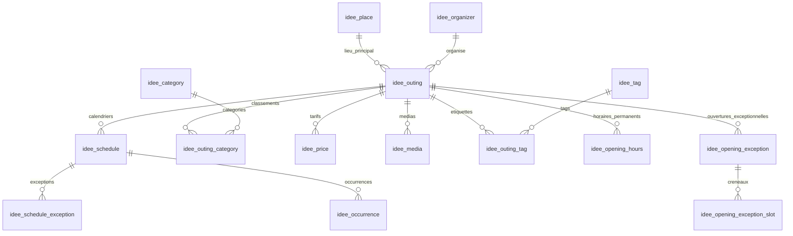

# Structure de la base `idee`

Toutes les tables métier portent le préfixe `idee_`. Les deux tables de suivi Liquibase portent le préfixe par défaut `databasechangelog`. Aucun utilisateur ou compte n’est requis.

## Le principe

Une **sortie** décrit ce que l’on peut faire. Un **calendrier** décrit quand cela se produit. Une **occurrence** est une séance concrète, calculée à partir du calendrier et de ses exceptions. Ne pas stocker une date unique directement dans la sortie, ni une chaîne « premier samedi » comme seule information exploitable.

## Tables

| Table | Rôle |
|---|---|
| `idee_outing` | Titre, description, événement/permanent, publication, lieu principal, organisateur, âge, durée indicative, intérieur/extérieur, réservation, accessibilité, source et date de vérification. |
| `idee_place` | Commune, département 67/68, adresse, coordonnées, accès et transports. Un créneau ou un report peut utiliser un autre lieu. |
| `idee_organizer` | Structure organisatrice et coordonnées publiques. |
| `idee_category`, `idee_outing_category` | Classement multiple ; catégories hiérarchiques possibles. |
| `idee_tag`, `idee_outing_tag` | Labels transversaux : poussette, animaux, pluie, etc. |
| `idee_price` | Plusieurs tarifs par public, gratuit/fixe/à partir de/don libre/inconnu, conditions et période de validité. Absence de prix ≠ gratuit. |
| `idee_media` | Photos ou illustrations par URL HTTPS, texte alternatif, ordre, crédit, licence et indicateur d’image principale. Une seule image principale par sortie. |
| `idee_schedule` | Début et fin locaux, fuseau IANA, journée entière, règle RRULE facultative, lieu et activation. |
| `idee_schedule_exception` | Exclusion, annulation visible, séance ajoutée ou report avec nouveaux horaires/lieu. |
| `idee_occurrence` | Cache des séances avec instants absolus, statut et lieu effectif. Identité stable métier = calendrier + début local d’origine. |
| `idee_opening_hours` | Horaires hebdomadaires d’une sortie permanente, avec bornes saisonnières, coupures et fermeture le lendemain. |
| `idee_opening_exception`, `idee_opening_exception_slot` | Jour fermé exceptionnellement ou remplacement complet des créneaux du jour. |
| `idee_calendar_projection` | Bornes exactes et date du dernier calcul, afin de distinguer absence de séances et calendrier non calculé. |

## Exemples de calendrier

| Besoin | Représentation |
|---|---|
| Concert le 12 juin, 20 h–23 h | Un calendrier, début/fin, `rrule=NULL`. |
| Festival continu du vendredi 18 h au dimanche 22 h | Un calendrier sur plusieurs jours. |
| Festival vendredi à dimanche, 10 h–18 h chaque jour | `FREQ=DAILY;COUNT=3` ; on ne présente pas les nuits comme ouvertes. |
| Premier samedi de chaque mois | `FREQ=MONTHLY;BYDAY=1SA`. |
| Dernier dimanche du mois | `FREQ=MONTHLY;BYDAY=-1SU`. |
| Mercredi et samedi | `FREQ=WEEKLY;BYDAY=WE,SA`. |
| Un week-end sur deux | `FREQ=WEEKLY;INTERVAL=2;BYDAY=SA` avec une durée locale de deux jours. |
| Les 14 juillet | `FREQ=YEARLY;BYMONTH=7;BYMONTHDAY=14`. |
| Marché estival | Règle hebdomadaire avec `UNTIL` ; autre calendrier pour la saison suivante. |
| Visites à 10 h et 15 h | Deux calendriers, ce qui permet des durées et tarifs de séance futurs distincts. |
| Dates irrégulières | Plusieurs calendriers ponctuels ou exceptions `include`. |
| Fête liée à Pâques, vacances ou jours fériés | Dates explicites par année, fournies par une source vérifiée ; aucune déduction automatique de calendrier scolaire. |
| Fermeture ou report exceptionnel | Exception attachée au début **d’origine**, jamais réécriture de toute la série. |
| Musée ouvert toute l’année | Sortie `permanent`, horaires saisonniers et exceptions ; les visites guidées peuvent avoir leurs propres calendriers. |

Les règles sont interprétées par [python-dateutil](https://dateutil.readthedocs.io/en/2.8.2/rrule.html), selon la syntaxe iCalendar. Choisir un `DTSTART` cohérent avec la règle ; `UNTIL` doit être en UTC pour une règle avec fuseau. Les fréquences de ce domaine sont limitées à jour/semaine/mois/année.

## Conventions indispensables

- Fuseau par défaut : `Europe/Paris`. Les règles sont écrites en heure locale : un marché à 10 h reste à 10 h après le passage à l’heure d’été.
- Tous les intervalles utilisent `[début, fin)` : une journée entière finit à minuit le lendemain, un festival du 1er au 3 finit le 4 à minuit. Le front affiche la dernière journée incluse.
- Chevauchement d’une recherche : `starts_at < fin_recherche AND ends_at > debut_recherche`. Cela inclut un événement déjà commencé.
- Pas de déplacement implicite du 31 vers le dernier jour du mois. Les dates invalides et heures inexistantes au changement d’heure sont ignorées. À l’heure d’automne ambiguë, la première occurrence de l’heure locale est retenue (`fold=0`).
- `exclude` supprime une séance du résultat ; `cancel` la conserve avec mention « annulé » ; `override` la déplace ; `include` en ajoute une. Les reports venant de l’extérieur de la fenêtre sont inclus s’ils arrivent dans la fenêtre.
- Pour modifier définitivement une série à partir d’une date : terminer l’ancien calendrier et en créer un nouveau. Pour une seule séance : exception.
- Le calcul est borné, ne crée jamais une infinité de lignes et reconstruit uniquement le cache `idee_occurrence`. Ne pas référencer l’ID technique de ce cache depuis une future billetterie ; utiliser `(schedule_id, original_start_local)`.
- Les horaires permanents sont une structure distincte de l’agenda. Le frontend initial ne calcule pas encore « ouvert maintenant » ; il invite à vérifier l’accès.
- Le script projette uniquement les calendriers activés, vérifie que les sources n’ont pas changé avant son écriture et publie les occurrences et leur couverture dans une transaction.

## Données DATAtourisme

Les migrations 007 à 009 ajoutent un modèle source rattaché au catalogue par `idee_datatourisme_event.outing_id` (unique), avec UUID DATAtourisme comme clé primaire. `payload` garde tous les champs et langues disponibles ; les traductions, contacts et leurs canaux, termes de classification, lieux/adresses et ressources disposent de tables enfants structurées. Voir [les tables détaillées et le fonctionnement de l'import](datatourisme.md#champs-structurés-supplémentaires).

Les checkpoints et quotas sont persistants. Une version de sélection permet d'enrichir les fiches déjà chargées par un nouveau parcours complet. Les dates de source sont distinctes des dates locales d'import ; l'archivage ne supprime pas le document source. Les indicateurs `start_time_known` et `end_time_known` du calendrier distinguent les horaires communiqués des bornes techniques servant aux recherches par date.

## Évolutions envisagées

Ajouter la saisie/import, les révisions de source, la pagination/recherche serveur et l’indexation géographique lorsque le catalogue le justifiera. Une sortie reste consultable sans connexion. La future administration devra être protégée avant toute ouverture d’API d’écriture.

## Descriptions éditoriales multilingues

La migration 011 ajoute `idee_outing_description` (clé : `outing_id`, `language`) pour `description_longue` et `description_courte`. La description courte est limitée en base à 300 caractères. Le texte source, le modèle, la version du prompt et la date de génération assurent la traçabilité. Les textes générés restent indépendants des traductions remplacées lors d'un import DATAtourisme.

La vue `idee_outing_description_source` fournit la description originale par langue depuis DATAtourisme, ou la description existante en français pour les autres sorties. Une réécriture n'est exposée que si sa source est toujours identique. Voir [le traitement Mistral](datatourisme.md#descriptions-réécrites-avec-mistral-une-sortie-à-la-fois).

